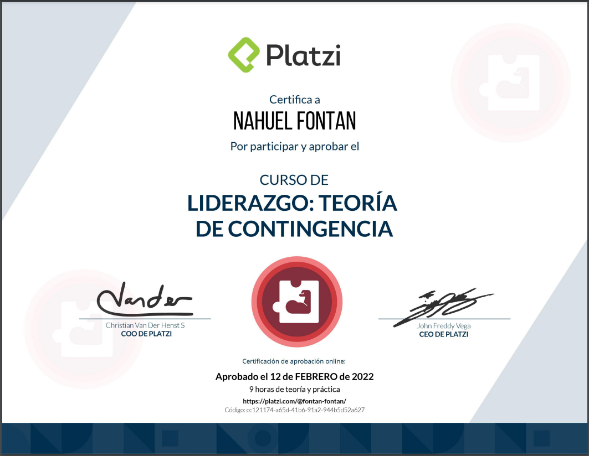

- 👋 Hi, I’m @Fontan7, I work as a backend developer and data. I speak English, Spanish and understand very basic Italian.
- 🖥️ Here you can find my [CV](assets/CvPRO.pdf).
- 👀 I’m interested in backend, games, and maps creation...
- 🌱 I’m currently: learning data engineering, and a side project...
- 💔 Not available to collaborate at the time...
- 📫 Reach to me: +34-627394275 -[Linkedin](https://www.linkedin.com/in/nahuel-fontan-02839715a/)

<!---
Fontan7/Fontan7 is a ✨ special ✨ repository because its `README.md` (this file) appears on your GitHub profile.
You can click the Preview link to take a look at your changes.
--->

## Certifications

